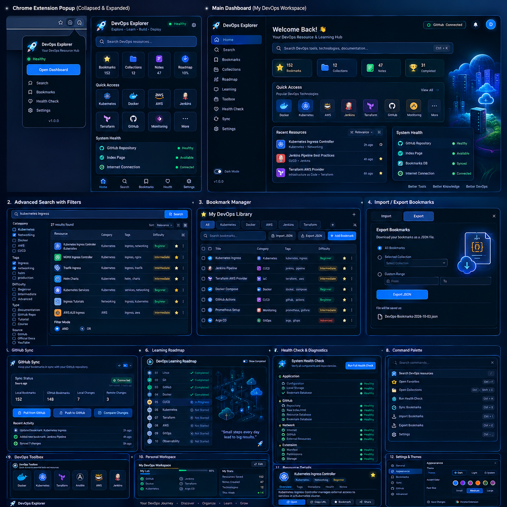

# DevOps Explorer Chrome Extension

A modern **Manifest V3 Chrome extension** that turns the existing **DevOps Explorer** GitHub project into a personal DevOps resource command center.

It lives inside the same repository under `chrome-extension/` and **does not duplicate the main DevOps Explorer application**. The extension reads the application and resource data from your configured raw GitHub paths.



## What is included

- 🚀 DevOps Explorer dashboard / personal workspace
- 🔗 Raw GitHub `index.html` launcher
- 📦 GitHub repository launcher
- 🔎 Local resource search
- 🔎 GitHub repository search
- 🏷️ Built-in DevOps categories
- #️⃣ Multiple category and tag filters
- AND / OR filtering
- 📊 Search results table
- ⭐ Bookmark manager
- 📚 Collections
- 📝 Personal bookmark notes
- 📥 Bookmark JSON import
- 📤 Bookmark JSON export
- 📥 **GitHub configuration JSON import**
- 📤 **GitHub configuration JSON export**
- 🕘 Recently viewed resources
- 🧰 DevOps technology toolbox
- 🧭 DevOps roadmap
- 🎓 Learning progress
- 🩺 Health and diagnostics center
- 📡 Raw GitHub endpoint checks
- ⏱️ HTTP response-time checks
- 🔄 Optional GitHub bookmark pull/push
- 🔐 Optional fine-grained GitHub token
- 🌙 Dark / light / system themes
- 🎨 DevOps Blue / Cyber Purple / Terminal Green / Cloud Orange accents
- ⚡ Command palette
- ⌨️ Keyboard shortcut support
- 🛠️ Developer diagnostics
- 🖼️ UI thumbnail
- 🚀 Chrome extension icons: 16 / 32 / 48 / 128px + SVG source
- 📖 Complete Markdown documentation
- ❌ No GitHub Actions
- ❌ No GitHub workflow
- ❌ No second repository
- ❌ No duplicated DevOps Explorer application
- ❌ No inline scripts that violate Chrome MV3 CSP

## Default GitHub configuration

The extension is preconfigured for the current DevOps Explorer repository:

```text
Repository:
https://github.com/awsrmmustansarjavaid/charlie-mj-devops-explorer

Branch:
main

Raw base:
https://raw.githubusercontent.com/awsrmmustansarjavaid/charlie-mj-devops-explorer/main

Raw index:
https://raw.githubusercontent.com/awsrmmustansarjavaid/charlie-mj-devops-explorer/main/index.html

Raw technologies DB:
https://raw.githubusercontent.com/awsrmmustansarjavaid/charlie-mj-devops-explorer/main/data/devops-technologies.json

Raw categories DB:
https://raw.githubusercontent.com/awsrmmustansarjavaid/charlie-mj-devops-explorer/main/data/devops-categories.json

Technologies DB path:
data/devops-technologies.json

Bookmark DB:
bookmark-db/bookmarks.json

Categories data:
data/devops-categories.json

Tags:
bookmark-db/tags.json

Metadata:
bookmark-db/metadata.json
```

Every value is editable in **Settings**.

## Repository structure

Place `chrome-extension/` inside your existing DevOps Explorer repository:

```text
devops-explorer/
│
├── index.html
├── css/
├── js/
├── assets/
├── data/
│   ├── devops-categories.json
│   └── devops-technologies.json
│
├── bookmark-db/
│   ├── bookmarks.json
│   ├── categories.json
│   ├── tags.json
│   └── metadata.json
│
└── chrome-extension/
    ├── manifest.json
    ├── README.md
    ├── version.json
    ├── assets/
    │   └── images/
    │       └── 25656fce-6771-45f7-ba28-2b26f7e9d7c8.png
    ├── bookmark-db/
    │   └── sample database files
    ├── icons/
    ├── css/
    ├── js/
    ├── popup/
    ├── pages/
    │   ├── dashboard/
    │   └── settings/
    └── docs/
```

The `chrome-extension/bookmark-db/` directory is a portable sample copy. The **default production paths point to the parent repository's root `bookmark-db/` directory**, as shown above.

## Install locally

1. Open Chrome.
2. Visit `chrome://extensions`.
3. Enable **Developer mode**.
4. Click **Load unpacked**.
5. Select the `chrome-extension/` directory.
6. Open the extension.
7. Open **Settings**.
8. Verify or edit the repository configuration.

The extension is fully local and does not require GitHub Pages or GitHub Actions.

## Settings

Settings includes editable defaults for:

- GitHub Repository URL
- Branch
- Raw Base URL
- Raw `index.html` URL
- Raw Technologies DB URL
- Technologies DB path
- Bookmark database path
- Categories path
- Tags path
- Metadata path
- GitHub fine-grained token
- Theme: Dark / Light / System
- Accent: DevOps Blue / Cyber Purple / Terminal Green / Cloud Orange
- Auto health checks

It also includes:

- **Save Settings**
- **Reset Defaults**
- **Import Config**
- **Export Config**

Configuration import/export uses JSON. For safety, exported configuration excludes the GitHub token by default. A separate checkbox allows the token to be included intentionally in a private configuration backup.

## Search

The search engine works even when the remote categories/technologies data is unavailable because it contains a built-in DevOps catalog fallback.

It supports:

- Free-text search
- Multi-word search
- Multiple categories
- Multiple tags
- Type
- Difficulty
- AND mode
- OR mode
- GitHub repository search

The extension first attempts to load:

```text
data/devops-technologies.json
```

from the configured raw GitHub URL. If that request fails or returns an invalid/empty dataset, the built-in catalog remains available.

## Bookmark database

The intended shared database is:

```text
bookmark-db/
├── bookmarks.json
├── categories.json
├── tags.json
└── metadata.json
```

Raw GitHub is used as a read source. The extension cannot modify a raw URL directly.

Optional write synchronization uses the GitHub Contents API and requires a user-supplied fine-grained token.

## GitHub sync

Pull:

```text
GitHub raw bookmark-db/bookmarks.json
        ↓
Chrome local bookmark store
```

Push:

```text
Chrome local bookmark store
        ↓
GitHub Contents API
        ↓
bookmark-db/bookmarks.json
```

The extension never stores the token in source code.

## Chrome MV3 CSP

All extension scripts are loaded from external JavaScript files using:

```html
<script type="module" src=".../file.js"></script>
```

There are no inline scripts in extension HTML pages. This avoids the common MV3 error:

```text
Executing inline script violates the following Content Security Policy directive 'script-src 'self''
```

## No GitHub workflow

This project intentionally contains no:

- `.github/workflows/`
- GitHub Actions
- deployment pipeline
- CI/CD requirement
- second repository

The extension is loaded locally through Chrome's Developer Mode and reads the existing GitHub project through raw URLs and the GitHub API where explicitly enabled.

## Documentation

- [Architecture](docs/ARCHITECTURE.md)
- [Features](docs/FEATURES.md)
- [Setup](docs/SETUP.md)
- [Configuration](docs/CONFIGURATION.md)
- [Bookmarks](docs/BOOKMARKS.md)
- [GitHub Sync](docs/GITHUB-SYNC.md)
- [Search](docs/SEARCH.md)
- [Health Checks](docs/HEALTH-CHECKS.md)
- [Customization](docs/CUSTOMIZATION.md)
- [Security](docs/SECURITY.md)
- [Development](docs/DEVELOPMENT.md)
- [Roadmap](docs/ROADMAP.md)
- [Troubleshooting](docs/TROUBLESHOOTING.md)
- [File Map](docs/FILE-MAP.md)
- [Validation](docs/VALIDATION.md)

## License

Use the same license as the parent DevOps Explorer repository unless the project has a different licensing policy.
